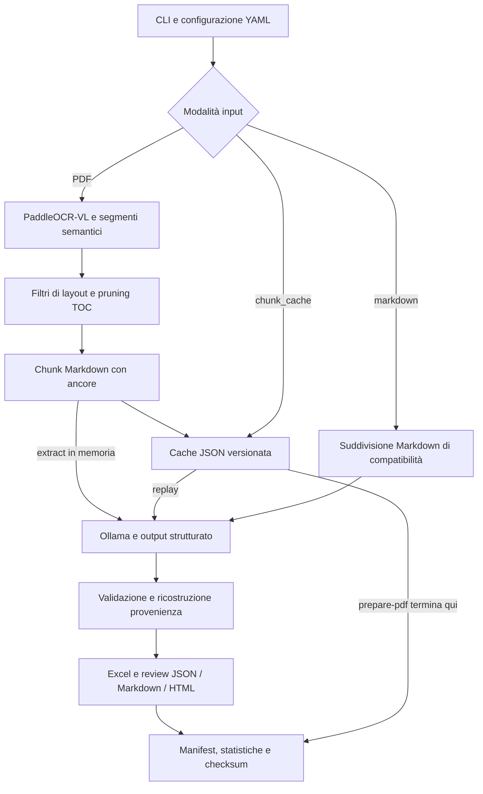

# Implementazione della pipeline di estrazione

Questa guida descrive il codice consolidato sulla branch `codex/evaluation-hardening`.
È una base per descrivere l'implementazione e ripetere le verifiche tecniche. La
correttezza del software verificabile con fixture non equivale alla qualità
dell'estrazione sui documenti reali: i riferimenti disponibili sono parziali e
il protocollo di valutazione deve ancora essere concordato.

## Architettura e responsabilità

La pipeline è un'applicazione Python a riga di comando. Per i PDF, PaddleOCR-VL
produce la rappresentazione semantica della pagina usando il servizio VLM
configurato. Un modello testuale servito da Ollama estrae i requisiti dal Markdown
con ancore. La pipeline ricostruisce pagine, regioni e riferimenti alle fonti
partendo dai segmenti citati dal modello.

| Componente | Responsabilità | Codice |
|---|---|---|
| CLI | Comandi, caricamento configurazione, logging, exit code | [main.py](../src/cli/main.py) |
| Configurazione | Dataclass, valori di default, validazione di modalità e limiti | [schema.py](../config/schema.py), [loader.py](../config/loader.py) |
| Orchestrazione | Scoperta input, batch, concorrenza, export, stato run | [requirement_extractor.py](../src/requirement_extraction/requirement_extractor.py) |
| Protezione esecuzioni | Input ordinati, collisioni, output preesistenti | [run_safety.py](../src/requirement_extraction/run_safety.py) |
| Adapter OCR | Segmenti, coordinate, pagine, immagini e pruning | [paddleocr_parser.py](../src/pdf_processing/paddleocr_parser.py) |
| Chunking | Aggregazione delle unità semantiche e ancore | [document_chunker.py](../src/requirement_extraction/document_chunker.py) |
| Cache | Serializzazione e validazione del contratto di replay | [chunk_cache.py](../src/requirement_extraction/chunk_cache.py) |
| Estrazione LLM | Prompt, schema JSON, tentativi di chiamata a Ollama | [prompt_templates.py](../src/llm_integration/prompt_templates.py), [ollama_client.py](../src/llm_integration/ollama_client.py) |
| Modelli dati | Requisito estratto e requisito arricchito con provenienza | [requirement.py](../src/data_models/requirement.py) |
| Export | Tabella Excel e artefatti per la revisione | [excel_writer.py](../src/requirement_extraction/excel_writer.py) e writer `review_*` |
| Riproducibilità | Versioni runtime, Git e checksum dei file | [reproducibility.py](../src/utils/reproducibility.py) |
| Valutazione | Confronto con riferimenti completi, separato dall'estrazione | [quality_evaluator.py](../src/evaluation/quality_evaluator.py) |

## Contratti dati

`SemanticDocument` contiene pagine ordinate; ogni `SemanticPage` contiene
`SemanticSegment` con testo, etichetta di layout, identificativo, geometria e
motivazione dell'eventuale esclusione. Il campo interno `page` è indicizzato da
zero, mentre `page_number` e gli intervalli pagina dei requisiti partono da uno.

`AnchoredMarkdownChunk` conserva il testo inviato all'estrattore insieme ai segmenti
completi e alle regioni sorgente. L'ancora `` permette al
modello di citare il segmento. L'identità del segmento resta relativa al documento;
non va utilizzato un ID da solo per unire informazioni di PDF diversi.

Il modello deve restituire `code`, `description` e `source_segment_ids`. Le pagine,
le coordinate e le immagini del requisito finale sono risolte dal codice. Le
citazioni sconosciute vengono rimosse e segnalate in `review_status`. In assenza di
citazioni valide il requisito viene mantenuto con la provenienza approssimata del
chunk e un flag di revisione. Quindi `allow_uncited_results=false` non elimina
automaticamente queste righe: modifica la segnalazione della revisione.

La deduplicazione elimina solo occorrenze con stessa sorgente, codice e descrizione.
Con `normalize_codes=true` la chiave confronta i codici in maiuscolo, senza
riscrivere il testo del codice esportato. Due documenti possono contenere lo stesso
requisito; due descrizioni differenti dello stesso codice rimangono ispezionabili.

## Preparazione, batch ed estrazione

1. La scoperta degli input restituisce file ordinati, rifiuta percorsi mancanti e
   selezioni vuote e rileva i nomi che produrrebbero artefatti in collisione.
2. Il parser preserva blocchi, tabelle testuali e regioni; filtra elementi tramite
   le etichette configurate. Le figure non sono incluse nel testo per l'estrazione.
3. Il pruning basato sull'indice ha tre modalità: `off`, `audit` (solo rapporto)
   ed `enforce`. L'esclusione per intervalli di pagina si applica solo quando
   l'indice supera i controlli di affidabilità implementati. È un'euristica e può
   escludere contenuto utile se le regole non sono adatte al documento.
4. Il chunker raggruppa segmenti fino al titolo successivo, poi combina le unità
   entro la soglia `max_chunk_chars`. La soglia è morbida: una singola unità può
   superarla per evitare di spezzare il contenuto associato a un titolo.
5. Con `batch_page_count`, le finestre PDF sono elaborate in sequenza. Per il
   pruning viene tentata una scansione preliminare dell'indice, poi il piano viene
   riutilizzato nelle finestre. Gli ID chunk includono la finestra, ad esempio
   `p001-005-chunk-1`, e coincidono tra cache e provenienza dei requisiti.
6. Dentro ogni gruppo di chunk, `parallel.enabled=true` usa un `ThreadPoolExecutor`
   con al più `max_workers` chiamate concorrenti. I risultati sono ordinati per
   posizione documentale prima dell'export.
7. Le citazioni vengono risolte, i risultati deduplicati e gli artefatti esportati.

`prepare-pdf` esegue preparazione e persistenza della cache senza estrazione
Ollama. `extract` con `input.mode=chunk_cache` riparte dalla cache e non esegue OCR
né ricostruisce i chunk. Cambiare `max_chunk_chars` nel solo profilo di replay non
modifica una cache esistente: per confrontare chunking diversi bisogna preparare
cache diverse.

La cache schema 1 richiede `chunks`, `chunk_count`, ID univoci, testo e sorgente
non vuoti, e coerenza tra `segment_ids` e `source_segments`. Una cache vuota è
ammessa se dichiarata esplicitamente. Il caricamento rifiuta contenuti malformati
senza convertirli in chunk vuoti. Le vecchie cache batch con ID ripetuti devono
essere rigenerate. I percorsi delle immagini conservati nella cache devono restare
accessibili per riprodurre anche la revisione HTML con sfondi delle pagine.

## Output e ciclo di vita del run

Ogni invocazione completa usa una cartella di output dedicata. Se contiene già
artefatti della pipeline, l'avvio viene rifiutato prima di modificarli. Il parametro
`output.overwrite_existing=true` abilita esplicitamente il riuso; non pulisce file
residui né rende sicure esecuzioni concorrenti nella stessa cartella. Per run
confrontabili si deve usare sempre una cartella nuova.
Il flag richiede un booleano YAML: stringhe come `"false"` o numeri come `1`
vengono rifiutati, non convertiti implicitamente.

Nel caso di più PDF, ogni documento ha una sottocartella
`documents/<nome-PDF>/` per OCR, immagini, cache e rapporti. Gli export aggregati e
il manifest rimangono nella radice del run. Per un singolo PDF il layout rimane
quello diretto, con eventuali finestre in `batches/<nome-PDF>/p001-005/`.

La [decisione sul layout dei report](adr/0001-source-document-report-layout.md)
descrive un obiettivo successivo: anche gli export di revisione saranno posseduti
dal singolo documento. Questa riorganizzazione è differita rispetto alla baseline
di consolidamento e non va presentata come già implementata.

| Artefatto | Contenuto e condizioni |
|---|---|
| `requirements.xlsx` | Codice, descrizione e metadati se abilitati; solo `extract` |
| `requirements.review.json` | Requisiti arricchiti, usati anche dal valutatore; configurabile |
| `requirements.review.md` | Rapporto leggibile; configurabile |
| `requirements.review.html` | Vista statica con regioni e immagini disponibili; configurabile |
| `<nome>.anchored.md` | Segmenti inclusi e ancore, senza istruzioni/few-shot del prompt; configurabile |
| `<nome>.chunks.json` | Chunk preparati e dati necessari al replay |
| `ocr-input.pdf`, `page-images/`, `ocr-pages/` | Input OCR, raster puliti e visualizzazioni native quando prodotte |
| `toc-pruning-report.json` | Decisioni del pruning, a livello documento/finestra |
| `run-manifest.json`, `run-stats.json` | Identità, configurazione, stato, errori, contatori e durata |

| Stato terminale | Significato | Esito CLI |
|---|---|---|
| `completed` | Pipeline terminata senza perdite tecniche rilevate dai contatori | Zero |
| `partial` | Export disponibili, ma chiamate LLM, parsing/schema o righe scartate hanno prodotto perdite | Non zero, `PartialExtractionError` |
| `failed` | Errore che impedisce di completare la pipeline, ad esempio input mancante o errore OCR | Non zero |

Una risposta valida `[]` è un risultato vuoto e non un errore tecnico. Un run
`completed` non garantisce che tutti i requisiti reali siano stati riconosciuti.
Un run `partial` conserva gli export recuperabili. In caso di errore fatale il
codice tenta di scrivere lo stato `failed`, senza nascondere l'errore originale se
anche la persistenza fallisce. Il rifiuto di una destinazione già occupata non
riscrive il manifest precedente. Gli errori prima della costruzione dell'estrattore
(per esempio YAML invalido) non producono un manifest.

Il logging viene configurato dalla CLI dopo il caricamento YAML. L'import dei moduli
non crea log su disco; console, file, livello e rotazione sono espliciti e la
riconfigurazione non duplica gli handler.

## Riproducibilità e ambiente

Il manifest schema 2 registra un ID run, impostazioni, sorgenti individuate,
contatori, versione Python, piattaforma, dipendenze principali, commit e stato
dirty di Git. Registra inoltre fingerprint del template di prompt, checksum dei
file di input e degli artefatti principali disponibili, e digest del modello
Ollama quando risolvibile. Non incorpora l'intero ambiente o tutti gli artefatti
annidati. Un commit con `dirty=true` non identifica da solo il codice eseguito.

I profili fissano `temperature=0.0` e `seed=42`; questo controlla il campionamento ma
non promette identità bit per bit tra hardware, runtime o build di modello diversi.
Il lock è una fotografia dell'ambiente Apple Silicon con Python 3.13.7. Il
consolidamento ha ricostruito un ambiente separato dai lock e verificato una copia
dei soli file versionabili, priva dei dati locali. Le evidenze offline e quelle
della prova OCR/LLM reale sono distinte in [validation.md](validation.md).

Il prompt `2026-09-22.1` usa esempi con output JSON analizzabile: i ritorni a capo
delle descrizioni sono escapati nel JSON e vengono recuperati durante il parsing.
L'esempio sulla continuazione del testo è sintetico e termina in modo esplicito
al titolo della sezione successiva. Queste correzioni rendono coerenti istruzioni
ed esempi; non dimostrano un miglioramento quantitativo della qualità del modello.

## Limiti da dichiarare nella descrizione dell'implementazione

- Le finestre batch non hanno sovrapposizione o ricomposizione esplicita dei
  requisiti che attraversano il confine tra due finestre.
- La soglia di chunking conta caratteri e non token; unità grandi possono superare
  il contesto effettivamente disponibile al modello.
- Le citazioni sono verificate per appartenenza ai segmenti disponibili, non per
  correttezza semantica o copertura integrale della descrizione.
- Filtri di layout, classificazione dei titoli e pruning TOC sono euristici; i
  rapporti e gli artefatti servono a ispezionarne gli effetti.
- Il percorso Markdown non offre la stessa provenienza geometrica dei PDF.
- Alcuni campi storici di configurazione non governano il percorso PDF canonico:
  `parser.language`, `extract_tables`, `use_textline_orientation`,
  `parallel.chunk_batch_size`, `output.sheet_name` e i flag di logging dei prompt
  e delle risposte non sono collegati alle relative operazioni. Le opzioni di
  splitting dei titoli e fusione dei piccoli chunk riguardano il percorso Markdown.
- Il client può scaricare il modello Ollama se assente; per una sessione senza
  accesso esterno occorre predisporre prima modelli e runtime locali.

## Riferimenti parziali e valutazione

Il valutatore corrente assume riferimenti completi per il perimetro confrontato.
Conta come falsi positivi i codici estratti assenti dal riferimento e come mismatch
le descrizioni diverse dopo la normalizzazione degli spazi. Se il gold omette
requisiti veri o parti di testo, questi conteggi non misurano correttamente gli
errori della pipeline. Anche il recall descrive solo i requisiti annotati, non
necessariamente la copertura dell'intero documento.

Fino alla definizione del protocollo con il professore, i riferimenti possono
guidare l'ispezione qualitativa e la verifica dei casi conosciuti. Non supportano
ancora classifiche con precision/recall/F1 globali attendibili. Non è stata
introdotta una modalità di scoring per gold parziale: una sua definizione richiede
criteri espliciti su pagine, sezioni, requisiti e completezza delle descrizioni.

Il PDF locale degli esempi contiene anche requisiti presenti nei few-shot del
prompt. È materiale di sviluppo e di smoke test, non un insieme indipendente su
cui stimare la capacità di generalizzazione. La valutazione finale deve usare
documenti separati da quelli impiegati nella costruzione del prompt.

Per descrivere il lavoro si possono seguire le sezioni di questa guida: obiettivo,
architettura, rappresentazione dei documenti, preprocessing, chunking e cache,
prompt e output strutturato, provenienza, gestione degli errori, riproducibilità e
limiti. La valutazione sperimentale resta una sezione successiva e distinta.
